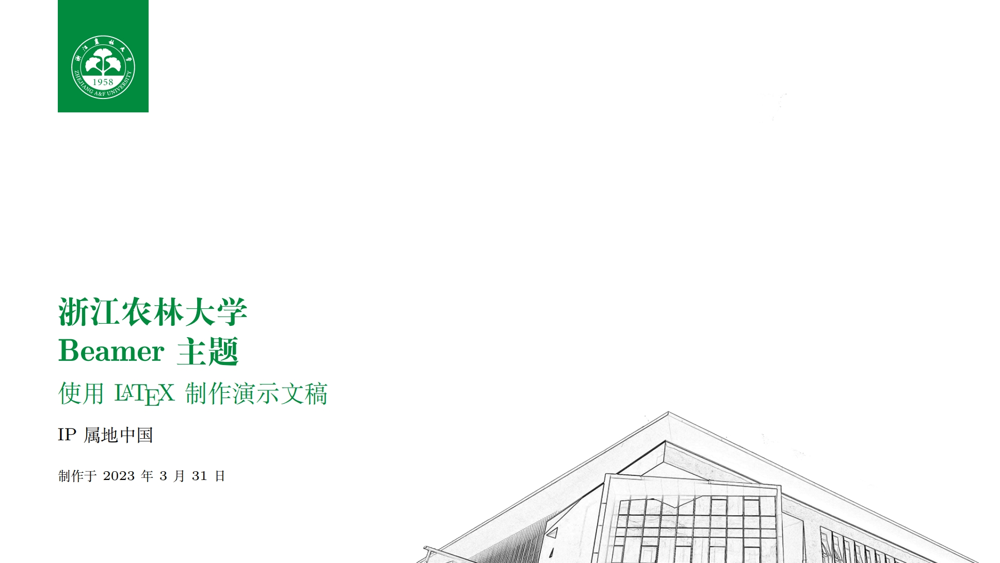
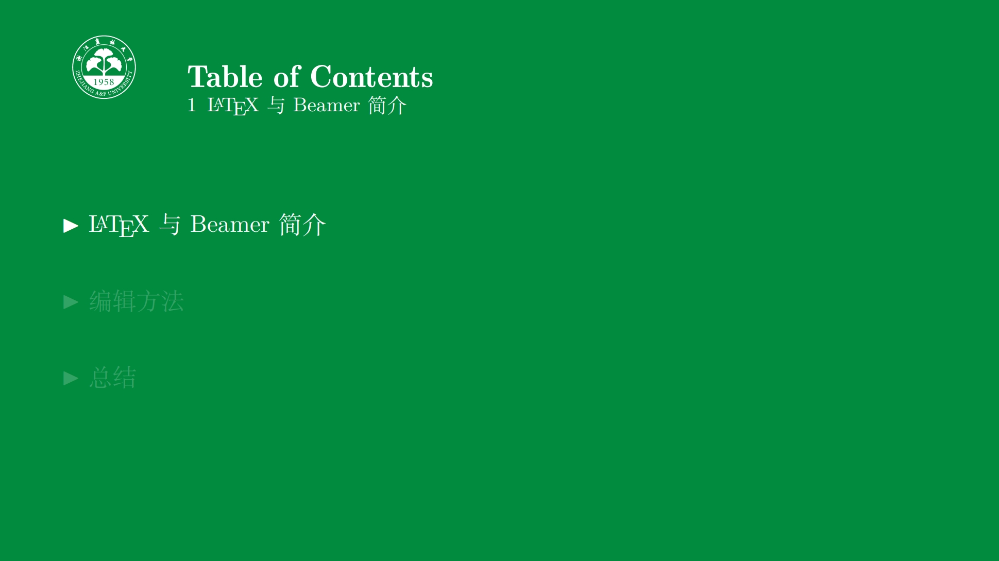
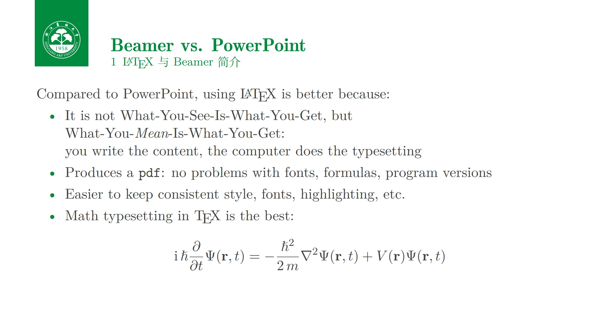
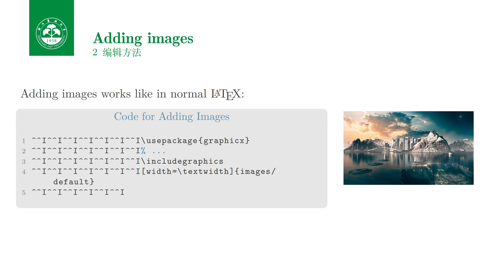

# ZAFUBeamer-Latex

这里是 [浙江农林大学](https://zafu.edu.cn) (**非官方**) Beamer Latex 模板 / This is [Zhejiang A &amp; F University](https://zafu.edu.cn) (**Unofficial**) Beamer Latex Template

本模版基于 [Qilong Liu](https://github.com/liu-qilong) 发布的 [Beamer-LaTeX-Themes](https://github.com/liu-qilong/Beamer-LaTeX-Themes) 中的 "深圳环境科学院 SAES Beamer 模版" 二次修改制作而成. 感谢 [Federico Zenith](https://github.com/liu-qilong/Beamer-LaTeX-Themes/blob/main/federico.zenith@sintef.no) 和 [Qilong Liu](https://github.com/liu-qilong), 非常棒的工作.

更多信息可参考 [Beamer-LaTeX-Themes](https://github.com/liu-qilong/Beamer-LaTeX-Themes).

## Copyrights

* 本仓库出现的所有[浙江农林大学](https://zafu.edu.cn)的标志、名称、校徽等均为[浙江农林大学](https://zafu.edu.cn)所有.

* 本仓库遵循 [Creative Commons Attribution 4.0 International](./LICENSE).

## Preview

